<a href="https://mohamed-tarek.com">
  
</a>

<p align="center">
  <a href="https://packagist.org/packages/mohamedtarek/laravel-stampede-guard"></a>
  <a href="https://packagist.org/packages/mohamedtarek/laravel-stampede-guard"></a>
  <a href="https://github.com/MohamedTarek/laravel-stampede-guard/actions/workflows/tests.yml"></a>
  <a href="https://mohamed-tarek.com"></a>
  <a href="https://www.linkedin.com/in/mt-elafifi"></a>
</p>

I build backends that stay up under load. Twelve years in, six of them designing distributed
systems and leading the engineers who run them. Laravel, Node.js and Go on the application side,
PostgreSQL and MySQL underneath, Redis and RabbitMQ in between.

```console
$ cat now.md
```

**Engineering Lead at Batsync** (software house, Cairo) since January 2026.

- Lead the engineering team (planning, code review, delivery) across **Ad Guardians**, **Lott AG**
  and **Franchise AG**, and maintain and extend their legacy PerfexCRM (PHP) platforms.
- Introduced CI/CD with **Woodpecker**: lint, PHPUnit, automated staging deploys with migrations,
  deploy results posted to ClickUp.
- **Dockerized** the apps (web, DB, Redis, queue workers) for all environments.
- **Stripe billing**: multi-subscription checkout, consolidated invoicing, upgrades, proration,
  wallet-to-Stripe migration.
- Moved Meta spend sync and location-fee jobs to **RabbitMQ** with partner-sharded queues.
- **REST API v2** (auth, wallet, ad accounts) with a 57-test PHPUnit suite.
- **AI tooling**: built a ClickUp MCP server (TypeScript); led delivery of the Lott AG CRM MCP
  server for safe AI querying of CRM data.
- Also: Telegram group automation, AI brand-theme generation, a Laravel AI ad-compliance pipeline
  and a Playwright lead scraper.

```console
$ ls ~/open-source
```

### [laravel-stampede-guard](https://github.com/MohamedTarek/laravel-stampede-guard)

Cache stampede prevention for Laravel 6 to 13. Two macros on the cache repository: an
atomic-lock `remember()` and a probabilistic early-refresh `remember()` (XFetch) with the
refresh lock handed from the request to a queued job.

| Strategy | Callback calls, 50 concurrent workers on a cold key |
|:--|--:|
| `Cache::remember` (plain) | 50 |
| `Cache::rememberWithLock` | **1** |
| `Cache::rememberXFetch` | **1** |

Measured in its own test suite, not claimed. PHPStan level 8, 98 tests, CI across 8 Laravel majors.

Write-up: [Cache stampedes in Laravel: why a lock isn't enough](https://medium.com/@mt.elafifi/cache-stampedes-in-laravel-why-a-lock-isnt-enough-2111080ad4fc).

```console
$ cat principles.md
```

| | |
|:--|:--|
| **Standards first** | CI/CD and code review from day one. Every repo my team touches follows the same rules: environment-tagged PR titles, typed branch names, a technical design task before any feature, and a review-then-QA gate before anything reaches production. |
| **Ownership over tasks** | Every engineer develops deep expertise in their domain while contributing across the codebase. When something breaks in their area, they're the go-to person. |
| **Production mindset** | If it can't be monitored or scaled, it shouldn't ship. Every architectural decision considers production impact and growth from day one. |
| **Mentor through code** | Every PR is a teaching moment. I grow engineers through review, not lectures. |

```console
$ git log --oneline --format='%ad  %s' -- career/
2026-01  Batsync         Engineering Lead
2024-09  MoneyMoon SA    Senior Software Engineer       fintech
2023-06  Suiiz App       Engineering Manager
2023-02  Suiiz App       Senior Backend Engineer
2020-06  Baramoda        Technical Lead
2019-06  Baramoda        Senior Web Developer
2018-07  Cloumerce       Co-Founder                     still running
2018-07  EbtikarIT       Full Stack Developer
```

<details>
<summary><b>MoneyMoon SA</b> (fintech), Sep 2024 to Jan 2026</summary>

- Extracted the Offers and Investments module into an independent microservice with Camunda BPMN
  for business process management, with load testing, API docs and a data migration plan.
- Owned B2B bank and payment gateway integrations (Alinma Bank, Clickpay, Amazon Payfort).
- Owned the backend deployment pipeline and dependency management.
- Built the push notification system (batch and individual) on Firebase Cloud Messaging and
  Huawei PushKit.
- Mentored junior engineers through code review, design review sessions and joint test planning
  with QA.
</details>

<details>
<summary><b>Suiiz App</b>, Feb 2023 to Sep 2024</summary>

- Built and managed the engineering team from the ground up: agile process, sprint planning,
  engineering standards, systematic code review.
- Drove the platform v2 architecture from stakeholder requirements to technical specs; designed
  and owned the profiles and geo-location microservices.
- Cut cloud infrastructure costs by 90% while improving performance by 20% through Kubernetes
  tuning and query optimization.
- Migrated production between cloud providers with zero downtime and zero data loss, using
  blue-green deployment.
</details>

<details>
<summary><b>Baramoda</b>, Jun 2019 to Dec 2022</summary>

- Led the engineering team and ran production infrastructure on AWS.
- Directed five products: Agrinable (agriculture), Environeur (Egypt's first online environmental
  waste management platform), HRMS, an operations system and a CRM.
- Modernized Agrinable to Laravel 8 and shipped online consultations, a job portal and a CV
  generator; built an expert system for soil and water analysis.
</details>

<details>
<summary><b>Cloumerce</b>, Jul 2018 to present</summary>

- Co-founded and solo-architected a multi-tenant SaaS platform for e-commerce operations:
  inventory, orders, shipping integration, automated invoicing and real-time tracking.
- Adopted by Egyptian merchants, facilitating over 1 million EGP in merchant revenue. Eight years
  in production, one engineer.
</details>

```console
$ cat stack.txt
```

`PHP` `Laravel` `Node.js` `Go` `PostgreSQL` `MySQL` `MongoDB` `Redis` `Elasticsearch` `RabbitMQ`
`Docker` `Kubernetes` `AWS` `Jenkins` `ArgoCD` `Woodpecker` `Stripe` `Camunda` `MCP`

```console
$ cat contact.json
{
  "website":  "https://mohamed-tarek.com",
  "linkedin": "https://www.linkedin.com/in/mt-elafifi",
  "email":    "mt.elafifi@gmail.com",
  "location": "Cairo, Egypt",
  "remote":   true
}
```
